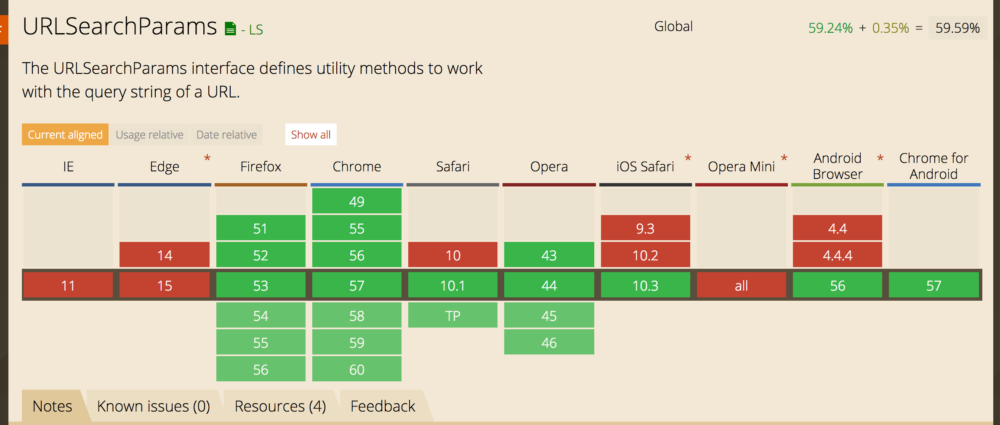

# js的URL参数操作

## URL信息

获取 http://www.example.com/page/index.html?name=hello&key=world#view-show-name

```js
// 获取URL信息
location

/*
{
  "href": "http://www.example.com/page/index.html?name=hello&key=world#view-show-name",
  "ancestorOrigins": {},
  "origin": "http://www.example.com",
  "protocol": "http:",
  "host": "www.example.com",
  "hostname": "www.example.com",
  "port": "",
  "pathname": "/page/index.html",
  "search": "?name=hello&key=world",
  "hash": "#view-show-name"
}
*/
```

## 获取URL信息

### 获取URL参数

#### 一般方法

兼容大部分浏览器

```js
function getURLParam ( name ) {
  if (typeof name === 'undefined') {
    return null;
  }

  let paramReg = new RegExp("(^|&)" + name + "=([^&]*)(&|$)", "i");
  let value = window.location.search.substr(1).match(paramReg);
  if (value != null) { 
    return unescape(value[2]); 
  }
  return false;
}

getURLParam('name')
// 返回 'hello'

getURLParam('key')
// 返回 'world'

```

#### 高阶方法

只兼容新版浏览器


```js
let params = new URLSearchParams(location.search);

params.has('name');
// 返回 true

params.get('name');
// 返回 'hello'

params.getAll("name");
// 返回 ['hello']

```

